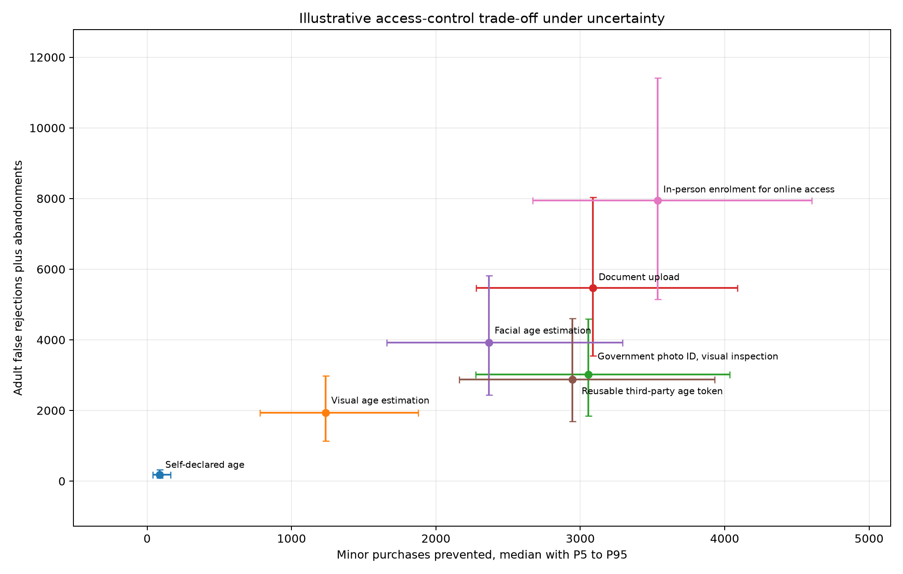
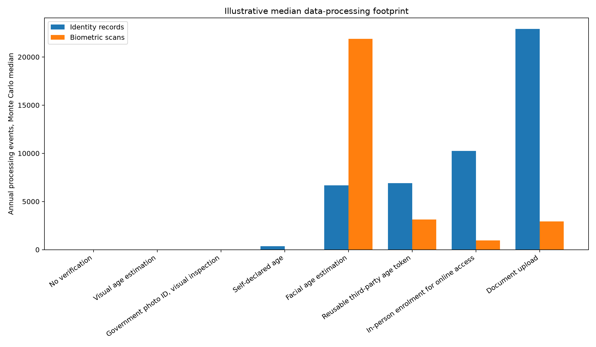

# AgeGate Harms

**A transparent policy simulator for measuring what age-assurance systems prevent, whom they burden, what data they create, and how much they cost.**

Age restrictions are often debated as though enforcement were a binary switch: verify age, block minors, problem solved. Real systems are not binary. Every age-assurance method has error rates, compliance costs, privacy consequences, accessibility failures, circumvention pathways, and distributional effects.

AgeGate Harms makes those trade-offs visible.

The project began as a case study of Quebec's 2026 energy-drink law, Bill 9, but the underlying model is intended to support analysis of age gates for social media, app stores, online marketplaces, games, adult content, AI services, and other regulated products or spaces.

> **Research status:** Version 0.1 is a working prototype. Its numerical inputs are illustrative assumptions, not empirical estimates of Quebec, Bill 9, any retailer, or any age-assurance vendor.

## Why this project exists

“Age assurance” is an umbrella term for systems that attempt to determine whether a person is above or below an age threshold. It can include:

- **Age declaration:** the user states a birth date or checks a box.
- **Age estimation:** a system infers an age or age range, sometimes from a face image or behavioural data.
- **Age verification:** a document, database, payment record, or trusted credential is used to establish age.
- **Reusable age credentials:** a third party verifies someone once and issues a token asserting that the person is over a threshold.
- **In-person checks:** a clerk inspects identification or a person enrols for later access.

These approaches do not merely differ in strictness. They create different systems of identification, surveillance, exclusion, and institutional power.

A system may prevent some prohibited transactions while also:

- rejecting lawful adult users;
- deterring people who do not want to disclose identity information;
- disproportionately burdening people without standard government ID;
- creating identity or biometric records that can be breached or repurposed;
- shifting transactions to less regulated channels;
- imposing fixed costs that large firms can absorb more easily than small businesses;
- producing a false sense that the underlying social or health problem has been solved.

AgeGate Harms does not assume that age restrictions are inherently illegitimate. It asks a narrower and more empirical question:

> Given a stated policy goal and a set of assumptions, what does each enforcement design actually do?

## Quebec Bill 9 and energy drinks

Quebec's **Bill 9, *Loi visant à prévenir les effets nocifs de la boisson énergisante sur la santé des jeunes***, was introduced on June 5, 2026, adopted on June 11, and sanctioned the same day as **2026, chapter 11**.

Most provisions are scheduled to enter into force on **December 11, 2026**. The provisions governing sales without the physical presence of the seller and buyer enter into force when the first regulation under section 4 takes effect.

The law does several things relevant to age-assurance policy:

1. It prohibits selling an energy drink to a person under 16.
2. It prohibits selling to an adult when the seller knows the adult is buying for someone under 16.
3. It prohibits a person under 16 from buying an energy drink or falsely claiming to be 16 or older.
4. It requires a prospective buyer, when asked, to prove that they are at least 16 using government or public-body photo identification showing their name and date of birth.
5. It requires the seller to refuse the transaction when the presented document does not adequately establish identity.
6. It generally prohibits sales without the physical presence of both the seller or employee and the buyer, including Internet and vending-machine sales, subject to future regulatory exceptions and alternative verification rules.
7. It treats giving an energy drink as equivalent to selling one.
8. It gives inspectors enforcement powers, including the ability, in defined circumstances, to demand proof of age from a person in or leaving a place where energy drinks are sold.
9. It creates fines for under-16 purchasers, adults, merchants, and people who obstruct inspectors or investigators.

For purposes of the law, an energy drink generally means a beverage containing at least **150 mg of caffeine per litre** plus other ingredients such as taurine, vitamins, or minerals. Coffee, tea, and specified natural health products are excluded unless regulations provide otherwise.

Official sources:

- [Bill 9 legislative history, National Assembly of Quebec](https://www.assnat.qc.ca/fr/travaux-parlementaires/projets-loi/projet-loi-9-43-3.html)
- [Sanctioned text, 2026, chapter 11](https://www.publicationsduquebec.gouv.qc.ca/fileadmin/Fichiers_client/lois_et_reglements/LoisAnnuelles/fr/2026/2026C11F.PDF)
- [Quebec government information on energy drinks](https://www.quebec.ca/en/health/nutrition/healthy-eating-habits/energy-drinks)
- [Health Canada information on caffeinated energy drinks](https://www.canada.ca/en/health-canada/services/food-nutrition/supplemented-foods/caffeinated-energy-drinks.html)

### Why Bill 9 is a useful case study

The law does not merely create an under-16 sales rule. It creates an age-assurance problem for ordinary retail transactions.

A policymaker therefore has to choose, explicitly or implicitly, among different enforcement designs:

- Ask only people who appear young for photo ID.
- Require every customer to present photo ID.
- Permit online document upload.
- Use facial age estimation.
- Create a reusable age token.
- Require in-person enrolment before online purchases.
- Prohibit remote and automated sales entirely.

Those choices can produce similar rates of minor-purchase prevention while imposing very different burdens on adults and creating very different quantities of identity data. That is the policy space this simulator is designed to examine.

## What the simulator models

Version 0.1 compares eight approaches:

1. No verification
2. Self-declared age
3. Visual age estimation by staff
4. Government photo ID inspected without retention
5. Document upload
6. Facial age estimation
7. Reusable third-party age token
8. In-person enrolment for later online access

For each method, the model estimates outcomes in five categories.

### Access-control outcomes

- Minor purchases prevented
- Minor purchases completed
- Adult false rejections
- Adult transaction abandonment
- Circumvention

### Privacy and data-processing outcomes

- Verification checks performed
- Identity records created
- Expected records exposed through breaches
- Third-party disclosures
- Biometric scans
- Centralized-record exposure

### Distributional outcomes

- Burdens on adults with elevated verification friction
- False rejections among higher-friction users
- Abandonment among higher-friction users

The “higher-friction” category is intentionally generic in version 0.1. Future evidence-backed versions should disaggregate relevant groups rather than treating them as interchangeable.

### Economic outcomes

- Variable verification costs
- Fixed implementation costs
- Total annual cost
- Cost per prohibited purchase prevented

### Comparative policy metrics

- Adult adverse outcomes per minor purchase prevented
- Identity records created per minor purchase prevented
- Cost per minor purchase prevented

No single metric determines whether a policy is justified. The simulator provides a common accounting framework so that normative disagreements are not disguised as technical inevitabilities.

## Illustrative experiment

The included experiment runs 50,000 Monte Carlo simulations using triangular distributions defined in [`data/assumptions.yaml`](data/assumptions.yaml).

The outputs include:

- deterministic results;
- median and uncertainty-interval estimates;
- policy trade-off charts;
- privacy-footprint comparisons;
- rank-correlation sensitivity analysis;
- a self-contained HTML dashboard;
- a machine-readable run manifest.

The current results should be read as a demonstration of the framework, not as a forecast. The most important output of version 0.1 is the evidence roadmap: it shows which uncertain variables have the greatest effect on each policy conclusion.





## Quick start

### Requirements

- Python 3.11 or newer
- [`uv`](https://docs.astral.sh/uv/)

### Install and run

```bash
uv sync --extra dev
uv run agegate-run --simulations 50000 --seed 20260722
uv run pytest
```

Results are written to `results/`.

Open the static dashboard:

```bash
xdg-open results/dashboard.html
```

### Interactive Streamlit interface

```bash
uv sync --extra ui
uv run streamlit run app.py
```

## Editing the scenario

The main assumptions are stored in:

```text
data/assumptions.yaml
```

Each uncertain parameter can be represented as a triangular distribution:

```yaml
adult_false_rejection_rate:
  low: 0.008
  mode: 0.025
  high: 0.065
```

The evidence registry is stored in:

```text
data/evidence.csv
```

A future evidence-backed release should record, for every major parameter:

- the source;
- jurisdiction and population;
- measurement date;
- central estimate and plausible range;
- whether the value is empirical, modelled, vendor-supplied, or expert judgment;
- known limitations and conflicts of interest.

## Project structure

```text
agegate-harms/
├── app.py
├── data/
│   ├── assumptions.yaml
│   └── evidence.csv
├── docs/
│   └── methodology.md
├── results/
│   ├── dashboard.html
│   ├── deterministic_results.csv
│   ├── monte_carlo_summary.csv
│   ├── sensitivity.csv
│   ├── tradeoff.png
│   └── privacy_footprint.png
├── src/agegate_harms/
│   ├── cli.py
│   ├── model.py
│   └── reporting.py
├── tests/
│   └── test_model.py
├── pyproject.toml
└── run_experiment.sh
```

## Methodological principles

### 1. Separate evidence from assumptions

A number appearing in a YAML file does not become evidence merely because Python can calculate with it. Version 0.1 labels all numerical inputs as illustrative.

### 2. Report uncertainty

Policy models should not convert weak inputs into falsely precise outputs. The Monte Carlo analysis reports distributions and intervals rather than relying only on point estimates.

### 3. Preserve competing values

Preventing prohibited purchases, preserving lawful adult access, minimizing data collection, reducing inequitable errors, and controlling costs are distinct objectives. The project does not collapse them into a single “ethical score.”

### 4. Model behavioural responses

People may abandon a transaction, ask someone else to buy, cross a jurisdictional boundary, switch products, or use an unregulated channel. A system's nominal detection accuracy is not the same as its real-world effectiveness.

### 5. Do not treat privacy as a slogan

“Privacy-preserving” is not a binary label. Relevant questions include what is collected, who receives it, whether it is retained, whether transactions can be linked, what happens after a breach, and whether the infrastructure can be reused for another purpose.

## What the project does not claim

AgeGate Harms does **not**:

- claim that energy drinks are harmless;
- determine whether an age restriction is constitutionally valid;
- provide legal or medical advice;
- estimate the health benefit of Bill 9;
- validate any commercial age-assurance vendor;
- assume that every identity check stores a copy of an ID;
- assume that every biometric system retains a face image;
- prove that one verification method is universally best;
- treat illustrative results as measured facts.

Health-risk assessment, constitutional analysis, enforcement design, and age-assurance impact modelling are related but separate research tasks.

## Research roadmap

Priority work for an evidence-backed Quebec release includes:

1. Estimate the number and type of affected transactions.
2. Measure how often sellers would request identification under realistic policies.
3. Find empirical false-rejection and abandonment rates.
4. Study access barriers for adults without conventional photo ID.
5. Document the data flows of proposed online verification methods.
6. Estimate circumvention, substitution, and cross-border purchasing.
7. Model retailer costs by business size and sales channel.
8. Distinguish transient inspection from scanning, storage, and third-party verification.
9. Add explicit health-benefit scenarios without embedding one disputed estimate as fact.
10. Update the simulator when Quebec adopts regulations under section 4.

## Contributing

Contributions are welcome, especially:

- empirical evidence and source review;
- additional policy scenarios;
- accessibility and distributional-impact research;
- privacy threat models;
- test coverage;
- bilingual English and French documentation;
- reproducibility improvements.

Please distinguish clearly between code changes, empirical claims, normative arguments, and illustrative assumptions.

## Independence and disclaimer

This is an independent research prototype. Unless an organization expressly adopts or publishes it, the repository should not be interpreted as an official statement by an employer, client, government body, or advocacy organization.

The project is provided for research and educational purposes. It is not legal, medical, or regulatory advice.

## License

Choose and add an open-source license before inviting public reuse. The MIT License is a simple permissive option for the code. Data and written research may warrant separate licensing or citation terms.
